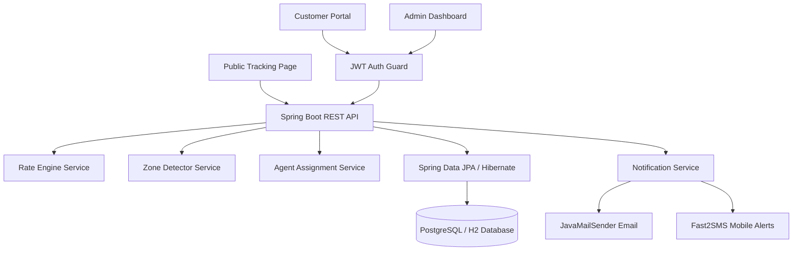

# 🚚 Last-Mile Delivery Tracker

A production-ready full-stack delivery management platform featuring a dynamic rate calculation engine, intelligent agent auto-assignment, immutable tracking history, multi-city zone coverage, and responsive role-based dashboards.

**Tech Stack:**
- **Frontend**: React (Vite) + Tailwind CSS + Lucide Icons + Axios + React Router
- **Backend**: Java 17+ / Spring Boot 3.3.x + Spring Data JPA + Spring Security (JWT) + JavaMailSender
- **Database**: PostgreSQL / H2 Database (PostgreSQL dialect compatibility)
- **Legacy Reference**: Node.js / Express backend archived in `backend-express/`

---

## 🌐 Quick Links & Documentation

- **Migration Guide**: [`MIGRATION_GUIDE.md`](./MIGRATION_GUIDE.md)
- **System Design Document**: [`system-design.md`](./system-design.md)
- **H2 Database Console**: `http://localhost:5000/h2-console` (JDBC URL: `jdbc:h2:mem:lastmile`, User: `sa`, Password: empty)

---

## 📋 Table of Contents
- [Features](#-features)
- [Architecture](#-architecture)
- [City & Zone Coverage](#-city--zone-coverage)
- [Quick Start Guide](#-quick-start-guide)
- [Default Seed Credentials](#-default-seed-credentials)
- [Database Schema](#-database-schema)
- [API Documentation](#-api-documentation)
- [Rate Calculation Logic](#-rate-calculation-logic)
- [Environment Configuration](#-environment-configuration)

---

## ✨ Features

### 👤 Customer Portal
- **Modern Landing Page**: Clean, minimalist hero section with interactive speed tier preview.
- **Order Booking Flow**: Structured address input with auto-zone lookup on pincode entry.
- **Speed & Rate Options**: Instant price breakdown across delivery tiers (*Standard*, *Express*, *Economy*).
- **Public & Authenticated Tracking**: Immutable milestone timeline accessible via direct URL (`/track/:id`) without login requirement.
- **Reschedule Flow**: Easy customer reschedule requests for failed delivery attempts.

### 🛡️ Admin Dashboard
- **Coverage & Zone Management**: Configure city zones and map 6-digit pincodes.
- **Dynamic Rate Cards**: Matrix editor for intra/inter-zone, B2B, and B2C rates per KG with minimum charge floors.
- **COD Surcharges**: Configure flat COD fees per order type.
- **Order Management & Auto-Assignment**: Overview metrics, pending orders queue, and one-click intelligent agent assignment.
- **Fleet Control**: Manage agent accounts, zone allocations, and availability statuses.
- **Customer Account Creation**: Create and manage customer accounts directly from admin.

### 🛵 Delivery Agent App
- **Assigned Queue**: View active delivery tasks assigned to the agent.
- **Status Updates**: Update order status (`Picked Up` → `In Transit` → `Out for Delivery` → `Delivered` / `Failed`).
- **Availability Toggle**: Switch operational status (`Available` / `Busy`).

---

## 🏗️ Architecture



### Directory Structure
```text
LastMileDelivery/
├── backend/                     # Spring Boot 3.3.x (Java 17) Backend
│   ├── src/main/java/com/lastmile/delivery/
│   │   ├── config/              # SecurityConfig, DatabaseSeeder
│   │   ├── controller/          # REST Controllers (/api/*)
│   │   ├── dto/                 # Request/Response Data Transfer Objects
│   │   ├── entity/              # JPA Entities (User, Order, Zone, RateCard, etc.)
│   │   ├── exception/           # ControllerAdvice & Custom Exceptions
│   │   ├── repository/          # Spring Data JPA Repositories
│   │   ├── security/            # JWT Token Provider, UserPrincipal, Filters
│   │   └── service/             # OrderService, RateEngine, AutoAssign, Auth
│   ├── src/main/resources/      # application.yml
│   └── pom.xml                  # Maven Dependencies
├── backend-express/             # Legacy Node.js Express Backend (Archive)
├── frontend/                    # Modern React SPA with Tailwind CSS
│   ├── src/
│   │   ├── pages/               # Customer, Admin, Agent, Tracking, Auth
│   │   ├── components/          # Navigation and shared components
│   │   ├── context/             # AuthContext
│   │   └── lib/                 # Axios API Client & Utility formatters
│   ├── tailwind.config.js       # Tailwind CSS Configuration
│   └── package.json
├── MIGRATION_GUIDE.md           # Express-to-SpringBoot In-Depth Guide
└── README.md                    # Project Documentation
```

---

## 🗺️ City & Zone Coverage

Seeded out-of-the-box upon startup:

| City | Zones | Sample Pincodes Mapped |
|---|---|---|
| **Mumbai** | North Mumbai, South Mumbai | `400066`, `400069`, `400001`, `400018` |
| **Thane & Navi Mumbai** | Thane, Navi Mumbai | `400601`, `400080`, `400703`, `410210` |
| **Pune** | Pune | `411005`, `411028`, `411038` |
| **Bengaluru** | Central, East, North | `560001`, `560066`, `560024`, `560100` |
| **Hyderabad** | Central, West | `500003`, `500016`, `500081`, `500032` |
| **Vijayawada** | Vijayawada | `520010`, `520002`, `520001`, `520007` |

---

## 🚀 Quick Start Guide

### Prerequisites
- **Java 17+** (OpenJDK or Eclipse Temurin)
- **Node.js 18+** & **npm**

### 1. Run Spring Boot Backend
```bash
cd backend
# Windows:
.\mvnw.cmd spring-boot:run

# Linux / macOS:
./mvnw spring-boot:run
```
The backend starts on `http://localhost:5000`. Database tables, default users, multi-city zones, 240+ rate cards, and agents are **automatically seeded** on the first run.

### 2. Run React Frontend
```bash
cd frontend
npm install
npm run dev
```
Open [http://localhost:5173](http://localhost:5173) in your browser.

---

## 🔑 Default Seed Credentials

| Role | Email | Password |
|---|---|---|
| **Super Admin** | `admin@lastmile.com` | `admin123` |
| **Test Customer** | `customer@test.com` | `customer123` |
| **Agent 1** (North Mumbai) | `agent1@lastmile.com` | `agent123` |
| **Agent 2** (South Mumbai) | `agent2@lastmile.com` | `agent123` |

---

## 📡 API Documentation

### Auth Endpoints (`/api/auth`)
| Method | Endpoint | Access | Description |
|---|---|---|---|
| POST | `/api/auth/register` | Public | Register customer account |
| POST | `/api/auth/login` | Public | Authenticate user (returns JWT token) |
| GET | `/api/auth/me` | Authenticated | Get currently logged-in user profile |
| PATCH | `/api/auth/profile` | Authenticated | Update name or phone number |
| GET | `/api/auth/customers` | Admin | Search/list customers |
| POST | `/api/auth/customers` | Admin | Create guest/customer record |

### Order & Tracking Endpoints (`/api/orders`)
| Method | Endpoint | Access | Description |
|---|---|---|---|
| POST | `/api/orders/calculate` | Public/Auth | Live rate calculation and tier breakdown |
| POST | `/api/orders` | Customer/Admin | Create new order |
| GET | `/api/orders` | Authenticated | List orders (filtered by user role) |
| GET | `/api/orders/{id}` | Authenticated | Get order details and full tracking history |
| GET | `/api/orders/{id}/track` | Public | Safe tracking timeline (no PII) |
| POST | `/api/orders/{id}/auto-assign` | Admin | Auto-assign nearest available agent |
| POST | `/api/orders/{id}/assign` | Admin | Manually assign specified agent |
| PATCH | `/api/orders/{id}/status` | Agent/Admin | Update status milestone |
| POST | `/api/orders/{id}/reschedule` | Customer/Admin | Reschedule delivery for failed order |

### Zones, Areas, & Rate Cards
| Method | Endpoint | Access | Description |
|---|---|---|---|
| GET / POST / PUT / DELETE | `/api/zones` | Auth / Admin | Manage coverage delivery zones |
| GET / POST / PUT / DELETE | `/api/areas` | Auth / Admin | Manage area pincodes |
| GET | `/api/areas/lookup/{pincode}` | Public | Pincode to zone lookup |
| GET / POST / PUT / DELETE | `/api/rate-cards` | Auth / Admin | Manage pricing matrix |
| GET / PUT | `/api/cod-surcharges` | Auth / Admin | Manage flat COD surcharge fees |
| GET / POST / PUT | `/api/agents` | Admin | Manage agent accounts and zone bindings |
| PATCH | `/api/agents/availability` | Agent | Toggle agent available/busy status |

---

## 💰 Rate Calculation Logic

```text
1. Volumetric Weight: (Length × Breadth × Height) / 5000
2. Billable Weight: MAX(Actual Weight, Volumetric Weight)
3. Base Rate: Lookup Rate Card (From Zone → To Zone, B2B/B2C)
   Base Charge = MAX(Billable Weight × Rate per Kg, Min Charge)
4. Tiers:
   - Standard: Base Charge
   - Express: Higher rate per kg with priority same-day dispatch
   - Economy: Lower rate per kg for bulk surface shipping
5. Total Charge: Base Charge + COD Surcharge (if COD selected)
```

---

## ⚙️ Environment Configuration

Configurations in `backend/src/main/resources/application.yml`:

| Environment Variable | Default Value | Description |
|---|---|---|
| `SERVER_PORT` | `5000` | HTTP Server port |
| `DATABASE_URL` | `jdbc:h2:mem:lastmile` | Database JDBC URL |
| `DATABASE_USERNAME` | `sa` | Database user |
| `DATABASE_PASSWORD` | `""` | Database password |
| `JWT_SECRET` | `(secret key)` | 256-bit signing key for JWT |
| `JWT_EXPIRATION_MS` | `604800000` (7 days) | JWT validity duration |
| `FRONTEND_URL` | `http://localhost:5173` | Allowed CORS origin |
| `EMAIL_HOST` / `EMAIL_PORT` | `smtp.gmail.com:587` | SMTP credentials |
| `FAST2SMS_API_KEY` | `""` | Fast2SMS mobile API key |
