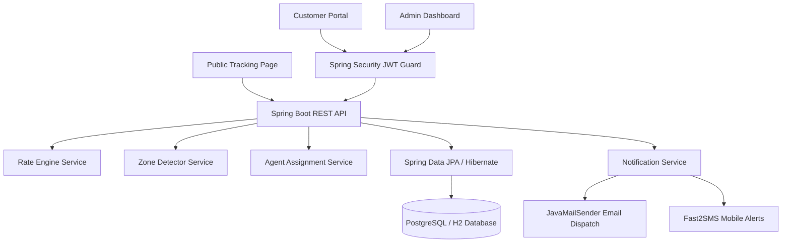
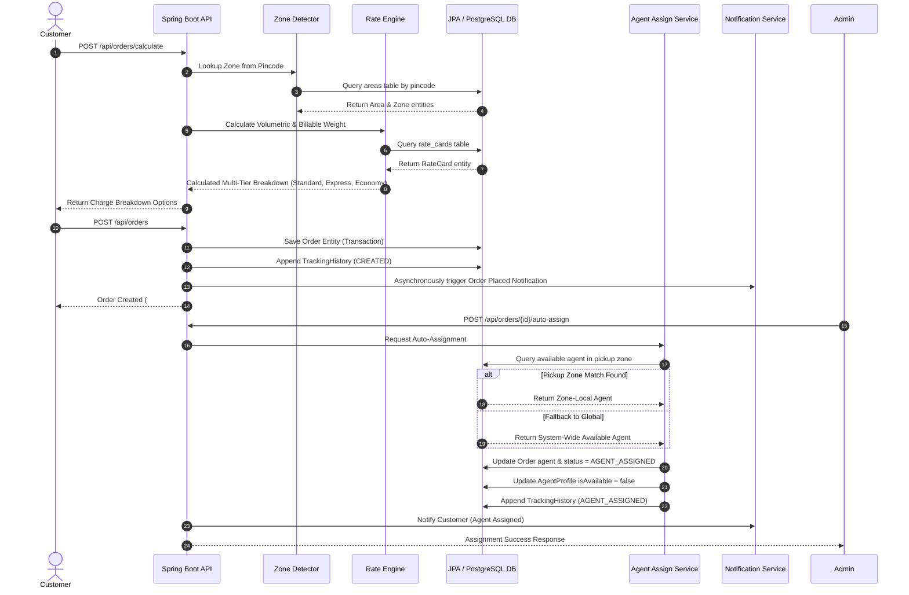
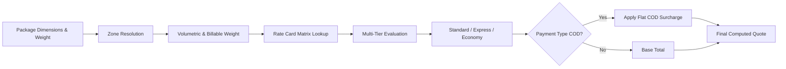
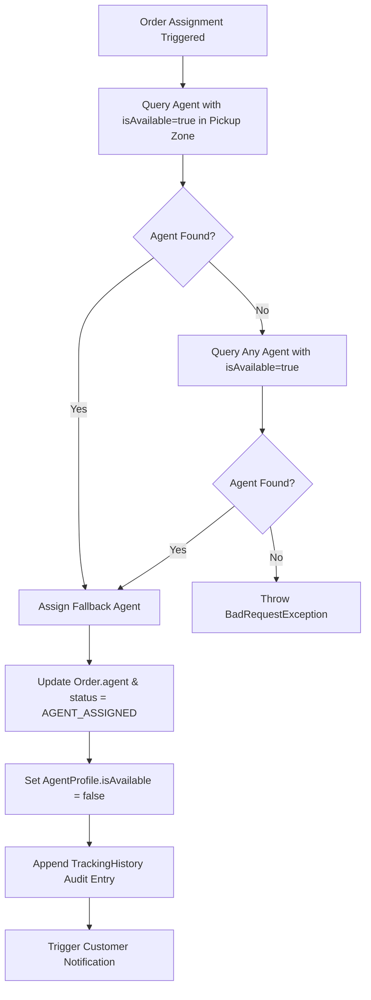
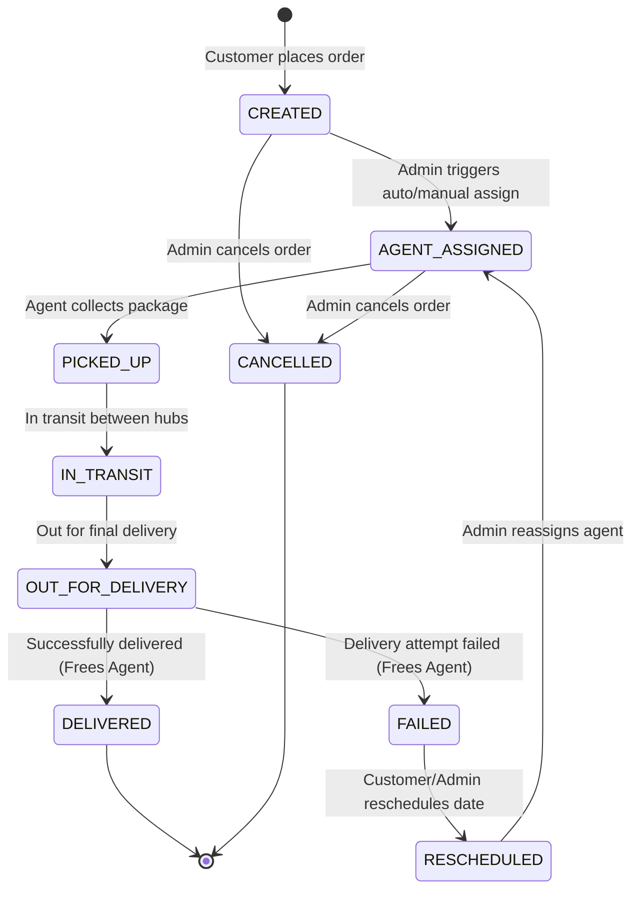

# 🏗️ System Design: Last-Mile Delivery Tracker

## Overview

The **Last-Mile Delivery Tracker** platform provides enterprise-grade last-mile logistics management featuring dynamic multi-tier rate calculations, zone-based routing, intelligent agent assignments, immutable audit lifecycles, and role-based access control.

---

## 1. System Architecture & Component Interactions

The system adopts a layered enterprise REST architecture with a stateless API layer and an immutable relational data model.

---

## 2. Dynamic Rate Calculation Engine

The rate engine evaluates shipments through a multi-tier pipeline:

### Calculation Algorithms
1. **Pincode Resolution**: O(1) indexed lookup via `AreaRepository.findByPincode(pincode)`.
2. **Volumetric Weight**: Formula: `(Length × Breadth × Height) / 5000.0`.
3. **Billable Weight**: `Math.max(actualWeight, volumetricWeight)`.
4. **Base Rate Card**: Query `(zone_from_id, zone_to_id, order_type)` matching B2B or B2C.
5. **Multi-Tier Pricing Strategies**:
   - **Standard Zone Delivery**: Base rate from zone rate card (or distance fallback).
   - **Express Same-Day Dispatch**: Point-to-point priority dispatch (`rate × 1.45`, higher floor).
   - **Economy Surface Transport**: Bulk budget ground transport (`rate × 0.75`).
6. **COD Surcharge**: Evaluated per order type from `cod_surcharges` table when `paymentType == COD`.

---

## 3. Intelligent Agent Auto-Assignment Logic

Agent assignment uses a 2-tier fallback model executed within a declarative `@Transactional` boundary:

---

## 4. Order Status Lifecycle & Immutable Audit History

All status transitions are strictly recorded in the append-only `tracking_history` table. Existing tracking entries are immutable.

### Immutable Tracking Record Schema
- `order_id`: Associated order UUID.
- `status`: New lifecycle milestone state.
- `changed_by_id`: User ID of actor triggering transition.
- `changed_by_role`: Role of actor (`CUSTOMER`, `AGENT`, `ADMIN`).
- `note`: Operational note, failure reason, or milestone description.
- `timestamp`: Server timestamp (`LocalDateTime.now()`).

---

## 5. Technology Stack Summary

| Layer | Component | Description / Rationale |
|---|---|---|
| **Frontend** | React 18 (Vite) + Tailwind CSS | Responsive SPA with custom design system, Lucide icons, and Axios |
| **Backend** | Java 17 + Spring Boot 3.3.3 | Enterprise-grade REST API with dependency injection and clean layered services |
| **Security** | Spring Security 6 + JJWT | Stateless JWT authentication filter with role-based method guards (`@PreAuthorize`) |
| **ORM & Data** | Spring Data JPA + Hibernate 6.5 | Type-safe repository abstraction with automatic schema updates and transactions |
| **Database** | PostgreSQL / H2 Database | PostgreSQL for production; in-memory H2 with PostgreSQL dialect for testing |
| **Email Service** | `spring-boot-starter-mail` | Asynchronous MIME HTML email dispatch using `JavaMailSender` |
| **SMS Service** | Fast2SMS Gateway | Asynchronous mobile notification integration via Spring `RestTemplate` |
| **Auto-Seeding** | `CommandLineRunner` | Idempotent startup seeder populating users, zones, areas, rate cards, and agents |
